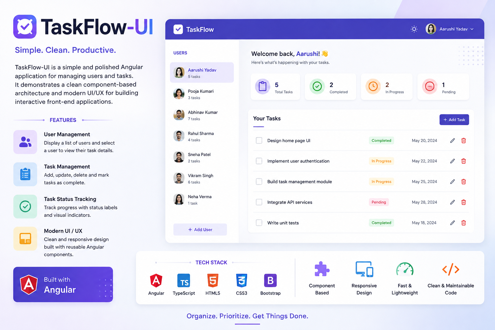

# Hi there, I'm Abhinav Kumar 👋

I am a **Full Stack Developer** with **4+ years of experience** specializing in building resilient, high-performance enterprise applications. My work focuses on scalable backend microservices, modern frontend architecture, and cloud deployment pipelines.

| 📧 [Email Me](mailto:abhinavkr356@outlook.com) | 🔗 [LinkedIn](https://www.linkedin.com/in/abhinavkumar02) | 📄 [Resume](https://drive.google.com/uc?export=download&id=13wbrMRxlPc5gTtwHMV2RmFbxpLS5FNoU) | 📞 +91 9155049490 |

---

### 💻 Core Tech Stack

| Domain | Technologies & Tools |
| :--- | :--- |
| **Backend** | .NET Core / C#, Web API, Microservices, RESTful APIs, Entity Framework Core |
| **Frontend** | Angular, TypeScript, JavaScript, HTML5, SCSS/CSS3, RxJS |
| **Cloud & DevOps** | Microsoft Azure, Azure DevOps, Docker, CI/CD Pipelines |
| **Databases** | SQL Server, PostgreSQL, Redis |
| **Architecture & Practices** | Clean Architecture, DDD (Domain-Driven Design), TDD, SOLID Principles |

---

### 🚀 What I'm Focused On

* **Enterprise Application Scalability:** Designing backend systems built for high throughput and maintainability.
* **Modern Frontend Architecture:** Building modular, component-driven UIs with Angular and clean state management.
* **AI Integration & Engineering:** Exploring Agentic AI workflows and practical AI integration in traditional full-stack stacks.

---

### 🛠 Featured Projects & Architecture Proofs

> *Note: Enterprise production code is proprietary, but these public repositories demonstrate my architectural thinking, engineering style, and product-building approach.*

#### 1️⃣ Social Media Post Microservices
* **Repository:** [sm-post-microservices](https://github.com/Abhinav4021/sm-post-microservices)
* **Overview:** An event-driven social media backend built around CQRS, Event Sourcing, and Apache Kafka. It demonstrates how command and query responsibilities can be separated into independent services while persisting domain events in MongoDB and projecting the read model into SQL Server.
* **Tech Stack:** .NET 10, ASP.NET Core, CQRS, Event Sourcing, Apache Kafka, MongoDB, SQL Server, Docker, EF Core.
* **Key Features:** Microservice orchestration, asynchronous event propagation, aggregate-root business logic, eventual consistency, and architecture diagrams that clarify the distributed design.
* **Visuals:**

  
  

#### 2️⃣ TaskFlow-UI
* **Repository:** [TaskFlow-UI](https://github.com/Abhinav4021/TaskFlow-UI)
* **Overview:** A polished Angular-based task and user management interface designed around modular components and a clean user experience. It emphasizes efficient front-end composition, reusable UI patterns, and a simple workflow for tracking users and related tasks.
* **Tech Stack:** Angular, TypeScript, HTML5, SCSS/CSS3, RxJS, component-driven architecture.
* **Key Features:** User listing, task interaction, modern UI styling, structured Angular modules, and a scalable frontend foundation for product workflows.
* **Visuals:**

  

---

### 📈 GitHub Analytics

  
  

